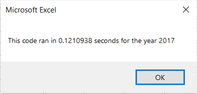
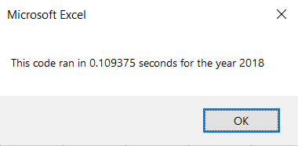

# Stock Analysis using VBA
## Overview of Project
The purpose of this analysis was to refactor the code in VBA to loop through stock data for year 2017 and 2018 and see if it worked more efficiently than the original code we had. By doing so, we will be able to analyze all the data and determine which stocks had a good or bad return rate.
## Results
After performing a stock analysis on all the stocks for both years it shows that in 2017 stocks had a greater return rate than in 2018. In the Return column on the All Stocks Analysis worksheet tab, you could see the cells are either red or green. If it's in green it means it had a postive return rate and if it's red then it had a negative return rate. This was done by using the following code:
     
      dataRowStart = 4
      dataRowEnd = 15

    For i = dataRowStart To dataRowEnd
          If Cells(i, 3) > 0 Then
          Cells(i, 3).Interior.Color = vbGreen
        Else
        Cells(i, 3).Interior.Color = vbRed
    End If
This allows you to better visualize whether it had a positive or negative return rate for each stock. Aside from analyzing the stock data, the execution time for the original script and refactored scipt was also analyzed. A code for a timer was added to calculate the amount of time it takes the code to run from beginning to end. Therefore, we are able to see if the refactored code works more efficiently than the original. 
After running the macro, the original script took 0.73 seconds to run for year 2017 and 2018.
However, as you can see in the images below, the execution time of the refactored script differs.

  
 

## Summary
Refactoring code is the process of changing an exisiting code without changing its external behavior. Some advantages of refactoring code are: code runs more efficient, cleaner code, and more organized. By making the code cleaner it makes it easier to fix bugs, and also help anyone who will be using an existing code read it with more ease. However, there may pose some disadvantages whenever refactoring code. One to consider is depending on how big the original code is for the system it might be too time consuming. 
In this analysis, refactoring the code decreased the execution time compared to the original scrpit. The execution time went from 0.25 seconds, with the original script, to 0.12 and 0.10 with the refactored script. Therefore making it the biggest advantage. 
